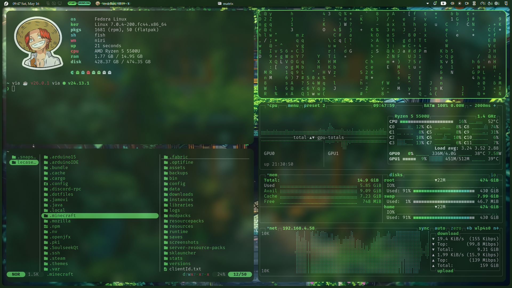

# dotfiles — Niri + Noctalia (green)

My first rice. Fedora 44 desktop, green palette, Niri compositor with Noctalia for everything shell-side. Not a final form but more of a starting point I'll keep iterating on as I figure out what I actually want. Sharing it because I have a loose link somewhere.



---

## The rice

| Layer | Choice |
|---|---|
| Compositor | [Niri](https://github.com/YaLTeR/niri) (YaLTeR COPR) |
| Shell / bar / launcher | [Noctalia](https://github.com/noctalia) — bar, launcher, lockscreen, notifications, idle, clipboard, wallpaper |
| Terminal | Ghostty |
| Shell | fish |
| Greeter | greetd + agreety (autologin via initial_session) |
| File managers | Nautilus, Yazi |
| Color scheme | Wallpaper-faithful (Noctalia) |
| Icons | Fluent-green-dark (`fluent-icon-theme`) |
| Cursor | Silksong |
| GTK theming | nwg-look |
| Qt theming | qt6ct |
| Fonts | Fira Code, P052, Twemoji |

**Display:** Wayland + XWayland satellite. Portals: `xdg-desktop-portal-gnome` (best Niri compatibility). Polkit via kf6 + Noctalia plugin. Clipboard: `wl-clipboard` + `cliphist`.

**Icon install:**
```bash
sudo dnf copr enable dusansimic/themes
sudo dnf install fluent-icon-theme
```
Then set `Fluent-green-dark` in both nwg-look and qt6ct.

> The rest of the app stack (browsers, media, dev tools, etc.) isn't part of the rice — swap in whatever you use. The pieces above are what makes it look like the screenshot.

---

## Boot Optimizations

These changes were made outside `~/` to reduce boot time. Documented here for reference. (or incase I forget)

### Kernel parameters — quiet boot

```bash
sudo grubby --update-kernel=ALL --args="quiet loglevel=3"
```

Stops boot messages printing to screen. Logs still accessible via `journalctl`.

**Revert:** `sudo grubby --update-kernel=ALL --remove-args="quiet loglevel=3"`

---

### GRUB timeout

Set `GRUB_TIMEOUT=0` in `/etc/default/grub`, then rebuilt config:

```bash
sudo grub2-mkconfig -o /boot/grub2/grub.cfg
```

Boots straight to default entry. To access the GRUB menu when needed, hold **Shift** or spam **Esc** immediately after BIOS handoff.

**Revert:** Set `GRUB_TIMEOUT=5` in `/etc/default/grub` and rebuild.

---

### Boot time (post-optimization)

```
firmware:   ~7s    (BIOS/UEFI — not reducible without BIOS tuning)
loader:     ~6.6s  (GRUB — reduced from 8.7s after timeout change)
kernel:     ~944ms
initrd:     ~6.5s  (dracut + hardware enumeration — expected)
userspace:  ~4.2s  (healthy)
─────────────────
total:      ~26s
```

Firmware and initrd times are largely hardware-bound.

---

## Known Issues

### niri-session deprecation warning

`niri-session` calls `systemctl --user import-environment` without a variable list, which triggers a systemd deprecation warning on login and shutdown. Tracked upstream at [niri#254](https://github.com/niri-wm/niri/issues/254). Harmless — left as-is pending upstream fix.

### Gray screen + three dots on boot

Briefly appears before the session loads. Unsure what it actually is — not a problem in practice, just noting it exists.
