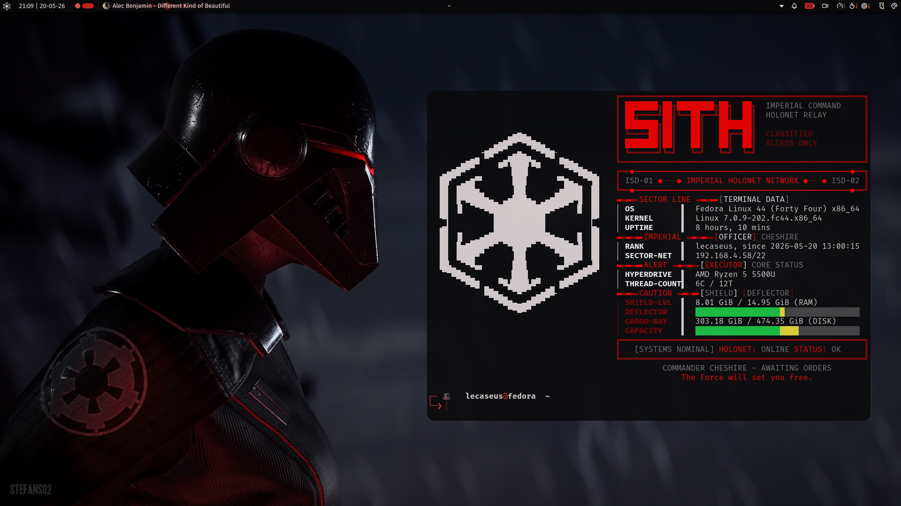

# dotfiles — Star Wars Sith Theme

This is my first completed setup. As of this posting, I am on Fedora 44 (custom OS), using Niri as my compositor/WM and Noctalia as my desktop-shell (its got everything I need so far). 



---

## The main components

| Layer | Choice |
|---|---|
| Compositor | [Niri](https://github.com/YaLTeR/niri) (YaLTeR COPR) |
| Shell / bar / launcher | [Noctalia](https://github.com/noctalia) — bar, launcher, lockscreen, notifications, idle, clipboard, wallpaper |
| Terminal | Ghostty |
| Shell | fish with starship |
| Greeter | greetd + agreety (autologin via initial_session) |
| File managers | Nautilus |
| Color scheme | Custom picked via Noctalia's Color Scheme Creator plugin |
| Icons | Graphite dark rimless |
| Cursor | Silksong |
| GTK theming | nwg-look |
| Qt theming | qt6ct |
| Fonts | Fira Code Nerd, Inter, Twemoji |

**Display:** Wayland + XWayland satellite. Portals: `xdg-desktop-portal-gnome` (best Niri compatibility). Polkit via kf6 + Noctalia plugin. Clipboard: `wl-clipboard` + `cliphist`.
```
> The rest of the app stack (browsers, media, dev tools, etc.) isn't part of the rice — swap in whatever you use. The pieces above are what makes it look like the screenshot. Its mainly just my fish, niri, starship, and noctalia configs at work.

---

## Boot Optimizations

These changes were made outside `~/` to reduce boot time. Documented here for reference. (or incase I forget)

### Kernel parameters — quiet boot

```bash
sudo grubby --update-kernel=ALL --args="quiet loglevel=3"
```

Stops boot messages printing to screen. Logs still accessible via `journalctl`.

**Revert:** `sudo grubby --update-kernel=ALL --remove-args="quiet loglevel=3"`

---

### GRUB timeout

Set `GRUB_TIMEOUT=0` in `/etc/default/grub`, then rebuilt config:

```bash
sudo grub2-mkconfig -o /boot/grub2/grub.cfg
```

Boots straight to default entry. To access the GRUB menu when needed, hold **Shift** or spam **Esc** immediately after BIOS handoff.

**Revert:** Set `GRUB_TIMEOUT=5` in `/etc/default/grub` and rebuild.

---

### Boot time (post-optimization)

```
firmware:   ~7s    (BIOS/UEFI — not reducible without BIOS tuning)
loader:     ~6.6s  (GRUB — reduced from 8.7s after timeout change)
kernel:     ~944ms
initrd:     ~6.5s  (dracut + hardware enumeration — expected)
userspace:  ~4.2s  (healthy)
─────────────────
total:      ~26s
```

Firmware and initrd times are largely hardware-bound.

---

## Known Issues

### niri-session deprecation warning

`niri-session` calls `systemctl --user import-environment` without a variable list, which triggers a systemd deprecation warning on login and shutdown. Tracked upstream at [niri#254](https://github.com/niri-wm/niri/issues/254). Harmless — left as-is pending upstream fix.

### Gray screen + three dots on boot

Briefly appears before the session loads. Unsure what it actually is — not a problem in practice, just noting it exists.

---

## System Tweaks

### GRUB kernel parameters

Added to `GRUB_CMDLINE_LINUX` in `/etc/default/grub`:

```bash
amd_pstate=active split_lock_detect=off pcie_aspm.policy=performance usbcore.autosuspend=-1 nowatchdog nmi_watchdog=0
```

Then rebuilt GRUB config:

```bash
sudo grub2-mkconfig -o /boot/grub2/grub.cfg
```

**`amd_pstate=active`** — enables AMD P-State driver for Zen 3, allows firmware-level frequency scaling via CPPC instead of the legacy acpi-cpufreq driver.

**`split_lock_detect=off`** — disables split lock detection, prevents stutters/crashes in games and anti-cheat running under Proton/Wine.

**`pcie_aspm.policy=performance`** — disables PCIe link power saving states, reduces latency spikes from devices waking from idle.

**`usbcore.autosuspend=-1`** — disables USB auto-suspend, prevents wake lag on peripherals.

**`nowatchdog nmi_watchdog=0`** — disables hardware watchdog timers, removes periodic CPU overhead.

**Revert:** remove the parameters from `GRUB_CMDLINE_LINUX` and rebuild.

---

### NVIDIA dGPU runtime power management

Enables RTD3 (PCI-Express Runtime D3) power management for the RTX 3050 so the dGPU can suspend when not in use.

> **Note:** On niri, the compositor holds `/dev/nvidia0` open even when rendering on the AMD iGPU, so the dGPU will remain `active` while the session is running. These configs are still valid and take effect for actual workload power gating.

udev rule — sets `power/control` to `auto` for NVIDIA PCI devices:

```bash
sudo tee /etc/udev/rules.d/80-nvidia-pm.rules << 'EOF'
SUBSYSTEM=="pci", ATTR{vendor}=="0x10de", ATTR{class}=="0x030000", TEST=="power/control", ATTR{power/control}="auto"
SUBSYSTEM=="pci", ATTR{vendor}=="0x10de", ATTR{class}=="0x030200", TEST=="power/control", ATTR{power/control}="auto"
EOF
```

Kernel module options:

```bash
echo 'options nvidia NVreg_DynamicPowerManagement=0x02' | sudo tee /etc/modprobe.d/nvidia-power.conf
echo 'options nvidia_drm modeset=1 fbdev=1' | sudo tee /etc/modprobe.d/nvidia-drm-modeset.conf
echo -e 'nvidia\nnvidia_modeset\nnvidia_uvm\nnvidia_drm' | sudo tee /etc/modules-load.d/nvidia.conf
sudo dracut --force
```

**`NVreg_DynamicPowerManagement=0x02`** — fine-grained power gating, allows the GPU to suspend between workloads.

**`modeset=1 fbdev=1`** — enables DRM kernel mode setting, required for Wayland.

Reference: [NVIDIA RTD3 documentation](https://download.nvidia.com/XFree86/Linux-x86_64/435.17/README/dynamicpowermanagement.html)

**Revert:** remove the files in `/etc/udev/rules.d/`, `/etc/modprobe.d/`, and `/etc/modules-load.d/`, then rebuild dracut.
